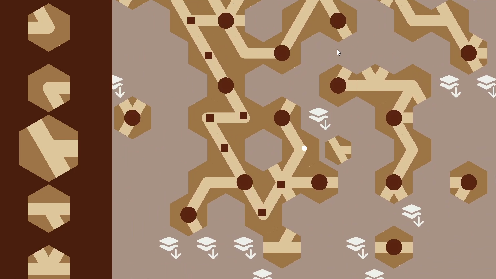

# Stairrific

A prototype for a puzzle game that involves building a path of staircases using hexagonal tiles.

I wrote a base Hex class using the Axial coordinate system as explained theoretically by [Redblobgames](https://www.redblobgames.com/grids/hexagons/).
The Model View framework was used to structure all Model logic in regular C# scripts, sending events to the Monobehaviour scripts attached to the View gameobjects in Unity.
I also implemented pathfinding within the hexagonal grid using Dijkstra's algorithm.

